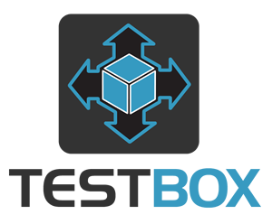

# Introduction

## TestBox BDD v5.x



**TestBox** is a next-generation testing framework for the [BoxLang](https://www.boxlang.io) JVM language and ColdFusion (CFML) based on [BDD](http://en.wikipedia.org/wiki/Behavior-driven\_development) (Behavior Driven Development) for providing a clean, obvious syntax for writing tests. It contains not only a testing framework, console/web runner, assertions, and expectations library but also ships with MockBox, A mocking and stubbing companion.&#x20;



```java
class{

  function run(){
  	describe( "My calculator features", () => {
	
		beforeEach( () => {
			variables.calc = new Calculator()
		} )
			
		// Using expectations library
		it( "can add", () => {
			expect( calc.add(1,1) ).toBe( 2 )
		} )
		
		// Using assert library
		test( "it can multiply", () => {
			$assert.isEqual( calc.multiply(2,2), 4 )
		} )
	} )
  }

}
```



```groovy
/**
 * My calculator features
 */
class{

	property calc;
	
	function setup(){
	    calc = new Calculator()
	}
	
	// Function name includes the word 'test'
	// Using expectations library
	function testAdd(){
	    expect( calc.add(1,1) ).toBe( 2 )
	}
		
	// Any name, but with a test annotation
	// Using assertions library
	@test
	function itCanMultiply(){
	    $assert.isEqual( calc.multiply(2,2), 4 )
	}
}
```



```cfscript
component{

  function run(){
  	describe( "My calculator features", () => {
	
		beforeEach( () => {
			variables.calc = new Calculator()
		} );
			
		// Using expectations library
		it( "can add", () => {
			expect( calc.add(1,1) ).toBe( 2 )
		} );
		
		// Using assert library
		test( "it can multiply", () => {
			$assert.isEqual( calc.multiply(2,2), 4 )
		} );
	} );
  }

}
```



```cfscript
/**
 * My calculator features
 */
component{
	
	property calc;
	
	function setup(){
	    calc = new Calculator()
	}
	
	// Function name includes the word 'test'
	// Using expectations library
	function testAdd(){
	    expect( calc.add(1,1) ).toBe( 2 )
	}
		
	// Any name, but with a test annotation
	// Using assertions library
	function itCanMultiply() test{
	    $assert.isEqual( calc.multiply(2,2), 4 )
	}
}
```



<figure><figcaption><p>Runner</p></figcaption></figure>

### Features At A Glance

Here is a simple listing of features TestBox brings to the table:

* BDD style or xUnit style testing
* Testing life-cycle methods
* [MockBox](http://wiki.coldbox.org/wiki/MockBox.cfm) integration for mocking and stubbing
* Mocking data library for mocking JSON/complex data and relationships
* Ability to extend and create custom test runners and reporters
* Extensible reporters, bundled with tons of them:
  * JSON
  * XML
  * JUnit XML
  * Text
  * Console
  * TAP ([Test Anything Protocol](http://testanything.org/))
  * Simple HTML
  * Min - Minimalistic Heaven
  * Raw
  * CommandBox
* Asynchronous testing
* Multi-suite capabilities
* Test skipping
* Test labels and tagging
* Testing debug output stream
* Code Coverage via [FusionReactor](https://fusion-reactor.com/)
* Much more!

## Versioning

TestBox is maintained under the [Semantic Versioning](https://semver.org) guidelines as much as possible. Releases will be numbered in the following format:

```
<major>.<minor>.<patch>
```

And constructed with the following guidelines:

* bumpBreaking backward compatibility bumps the major (and resets the minor and patch)
* New additions without breaking backward compatibility bump the minor (and resets the patch)
* Bug fixes and misc changes bump the patch

## License

TestBox is open source and licensed under the [Apache 2](https://www.apache.org/licenses/LICENSE-2.0.html) License. If you use it, please try to mention it in your code or website.

* Copyright by Ortus Solutions, Corp
* TestBox is a registered trademark by Ortus Solutions, Corp


The ColdBox Websites, Documentation, logo, and content have a separate license, and they are separate entities.


## Discussion & Help

* Help Group: [https://community.ortussolutions.com/c/communities/testbox/11](https://community.ortussolutions.com/c/communities/testbox/11)
* BoxTeam Slack : [https://boxteam.ortussolutions.com](https://boxteam.ortussolutions.com)

## Reporting a Bug

We all make mistakes from time to time :) So why not let us know about it and help us out? We also love pull requests, so please star us and fork us: [https://github.com/Ortus-Solutions/TestBox](https://github.com/Ortus-Solutions/TestBox)

* By Jira: [https://ortussolutions.atlassian.net/browse/TESTBOX](https://ortussolutions.atlassian.net/browse/TESTBOX)

## Professional Open Source

.png>)

TestBox is a professional open source software backed by [Ortus Solutions, Corp](https://www.ortussolutions.com/products/testbox) offering services like:

* Custom Development
* Professional Support & Mentoring
* Training
* Server Tuning
* Security Hardening
* Code Reviews
* [Much More](https://www.ortussolutions.com/services)

## Resources

* Official Site: [https://www.ortussolutions.com/products/testbox](http://www.ortussolutions.com/products/testbox)
* Current API Docs: [https://apidocs.ortussolutions.com/testbox/current](https://apidocs.ortussolutions.com/testbox/current)
* Help Group: [https://community.ortussolutions.com/c/communities/testbox/11](https://community.ortussolutions.com/c/communities/testbox/11)
* Source Code: [https://github.com/Ortus-Solutions/TestBox](https://github.com/Ortus-Solutions/TestBox)
* Bug Tracker: [https://ortussolutions.atlassian.net/browse/TESTBOX](https://ortussolutions.atlassian.net/browse/TESTBOX)
* Twitter: [@ortussolutions](http://www.twitter.com/ortussolutions)
* Facebook: [https://www.facebook.com/ortussolutions](https://www.facebook.com/ortussolutions)

#### HONOR GOES TO GOD ABOVE ALL

Because of His grace, this project exists. If you don't like this, don't read it, it's not for you.

> Therefore being justified by **faith**, we have peace with God through our Lord Jesus Christ: By whom also we have access by **faith** into this **grace** wherein we stand, and rejoice in hope of the glory of God. - Romans 5:5
