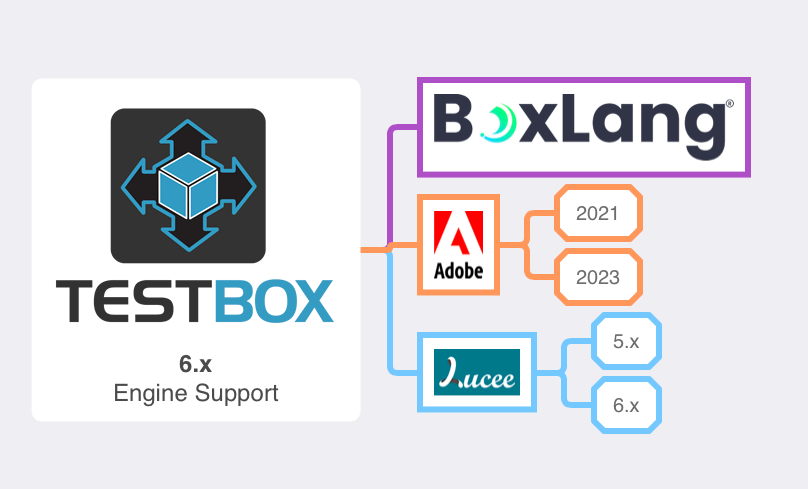

# Installation

## Framework

TestBox can be installed via [CommandBox CLI](https://www.ortussolutions.com/products/commandbox) as a development dependency in your projects:

```bash
// Create a new project
mkdir myProject --cd

// latest stable version
box install testbox --saveDev

// latest bleeding edge
box install testbox@be --saveDev
```


Please note the `--saveDev` flag, which tells CommandBox that TestBox is a development dependency and not a production dependency.



DO NOT USE TESTBOX IN PRODUCTION.


The only requirement is that it be in either in the webroot or in a location where you create a `/testbox` mapping to it's folder.

### System Requirements

*  [BoxLang 1+](https://boxlang.io) Language (Our preference)
* CFML Engines: Lucee 5.x+ or ColdFusion 2018+


TestBox has been designed to work in the BoxLang language and can also be compatible in CFML languages.


### What's Included

Here is a table of what's included in the installation package:

<table><thead><tr><th width="206">Folder</th><th>Description</th></tr></thead><tbody><tr><td><strong>bx</strong></td><td>BoxLang tools</td></tr><tr><td><strong>cfml</strong></td><td>CFML Tools</td></tr><tr><td><strong>system</strong></td><td>The main system framework folder</td></tr><tr><td><strong>test-visualizer</strong></td><td>A static visualizer of JSON reports. Just drop in a <code>test-results.json</code> and run it!</td></tr><tr><td><strong>tests</strong></td><td>Several sample tests and runners are actually used to build TestBox</td></tr></tbody></table>

####  BoxLang Tools

In the `bx` folder you will find specific BoxLang tools:

<table><thead><tr><th width="166">Folder</th><th>Description</th></tr></thead><tbody><tr><td><strong>test-browser</strong></td><td>This is a little utility to facilitate navigating big testing suites. This helps navigate to the suites you want and execute them instead of typing all the time.</td></tr><tr><td><strong>test-harness</strong></td><td>A vanilla test runner for any application</td></tr><tr><td><strong>test-runner</strong></td><td>A simple GUI test runner</td></tr></tbody></table>

#### CFML Tools

In the `cfml` folder you will find specific BoxLang tools:

<table><thead><tr><th width="165">Folder</th><th>Description</th></tr></thead><tbody><tr><td><strong>test-browser</strong></td><td>This is a little utility to facilitate navigating big testing suites. This helps navigate to the suites you want and execute them instead of typing all the time.</td></tr><tr><td><strong>test-harness</strong></td><td>A vanilla test runner for any application</td></tr><tr><td><strong>test-runner</strong></td><td>A simple GUI test runner</td></tr></tbody></table>

### IDE Tooling

Now that you are installed, please set up your favorite IDE with our tooling extensions so it can make your testing experience more enjoyable.


[ide-tools.md](ide-tools.md)


## TestBox CLI

TestBox comes with its own CLI for CommandBox.  You can use it to generate tests, harnesses, and suites and also run executions from the CLI.

```bash
install testbox-cli
```

You will now have the `testbox` namesapce available to you, try it out

```bash
testbox help
```

### Generating a Testing Harness

Once you install TestBox, you'll need a quick way to set up a testing harness. The `generate harness` command will add a new `/tests` folder to your application with a few example tests to get you started.

```bash
testbox generate harness
```

You can then run your tests by executing the `testbox run` command or by visiting the runner in the generated harness: `http://localhost/tests/runner.cfm`

```bash
testbox run --help
```

### Generating Tests

You can also use the CLI to generate tests according to your style

```bash
testbox create bdd --help
testbox create unit --help
```
