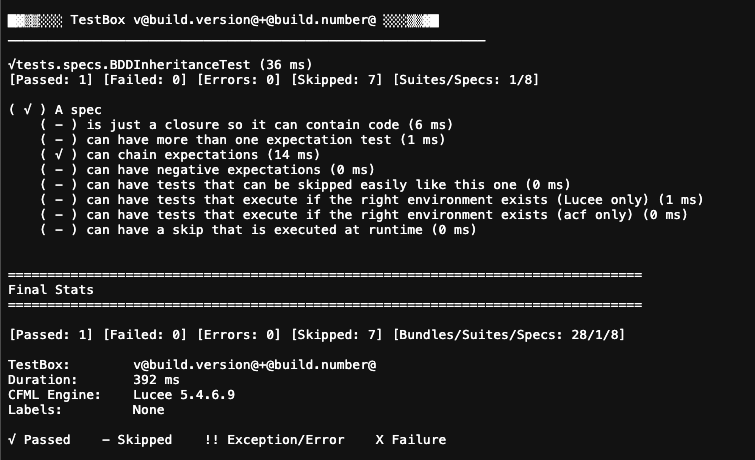

# Overview

**TestBox** is a next-generation testing framework for the [BoxLang](https://www.boxlang.io) JVM language and ColdFusion (CFML) language based on [BDD](http://en.wikipedia.org/wiki/Behavior-driven\_development) (Behavior Driven Development) for providing a clean, obvious syntax for writing tests. It contains not only a testing framework, console/web runner, assertions, and expectations library but also ships with several mocking utilities.

### Styles

In TestBox you can write your tests in two different styles or approaches.

#### BDD (Behavior Driven Development)

BDD stands for **behavior-driven development** and is highly based on creating specifications and expectations of results in a readable DSL (Domain Specific Language).  You are not focusing on a specific unit and method to test, but on functionality, features and more.  This can encompass not only unit but also integration testing.  You have several methods that you can use in order to denote functionality and specifications:

* `describe()`
* `feature()`
* `story()`
* `given(), when(), then()`
* `it() or test()`

```cfscript
describe( "My calculator features", () => {
	
	beforeEach( () => {
		variables.calc = new Calculator()
	} )
		
	// Using expectations library
	it( "can add", () => {
		expect( calc.add(1,1) ).toBe( 2 )
	} )
	
	// Using assert library
	test( "it can multiply", () => {
		$assert.isEqual( calc.multiply(2,2), 4 )
	} )
} )
```

#### xUnit (Test Driven Development)

xUnit style of testing is the more traditional TDD or **test-driven development** approach where you create a test case bundle class that matches the software under test, and for each method in the SUT, you create a test method in the test bundle class.

```java
@DisplayName "My calculator features"
class{

	property calc;
	
	function setup(){
		calc = new Calculator()
	}
	
	// Function name includes the word 'test'
	// Using expectations library
	function testAdd(){
		expect( calc.add(1,1) ).toBe( 2 )
	}
		
	// Any name, but with a test annotation
	// Using assertions library
	@DisplayName "It can multiply two operands"
	@test
	function itCanMultiply(){
		$assert.isEqual( calc.multiply(2,2), 4 )
	}
}
```

### Assertions & Expectations

We also give you two ways to do assertions:

1. [Assertions](testbox-xunit-primer/assertions.md) library, which is a traditional approach to assertions
2. [Expectations](../digging-deeper/expectations/) library, which is a more fluent approach to assertions.

```cfscript
// Assertions
assert( expression, "custom message" )

// Expectations
expect( structKeyExists( handler, "mixinTest" ) ).toBeTrue();
expect( structKeyExists( handler, "repeatThis" ) ).toBeTrue();
expect( structKeyExists( handler, "add" ) ).toBeTrue();
expect( target.$callLog().relocate[ 1 ].url ).toInclude( "dashboard" );
```

### Life-Cycles

Both approaches also offer different [life-cycle](../digging-deeper/life-cycle-methods.md) callbacks so you can execute code during different times in the test execution.



```cfscript
beforeEach( function( currentSpec ){
    setup();
    target = prepareMock( getInstance( "coldbox.system.FrameworkSupertype" ) );
} );

afterEach( function( currentSpec ){
    getCache( "template" ).clearAll();
    variables.scheduler.shutdown();
} );


function beforeAll() {
	super.beforeAll();
	
	// Login User
	variables.loggedInData = loginUser();
	
	variables.loggedInUserId = variables.loggedInData.user.getUserId();
	
	variables.testTimeOffEmployeeId = qb
		.select( "FK_userId" )
		.from( "timeOff" )
		.where( "requestType", "vacation" )
		.first()
		.FK_userId;
}

function afterAll() {
	variables.userService.clearCaches()
}
```



```cfscript
function setup() {
	super.setup();

	if ( !isNull( request.testUserData ) ) {
		getRequestContext().setValue( "x-auth-token", request.testUserData.token.access_token );
	}

	return;
}

function tearDown(){
	request.clear()
}

function beforeTests() {
	
	// Login User
	variables.loggedInData = loginUser();
	
	variables.loggedInUserId = variables.loggedInData.user.getUserId();
	
	variables.testTimeOffEmployeeId = qb
		.select( "FK_userId" )
		.from( "timeOff" )
		.where( "requestType", "vacation" )
		.first()
		.FK_userId;
}

function afterTests() {
	variables.userService.clearCaches()
}
```



### Utilities

TestBox will also offer different utilities:

* Debug output to a debug buffer
* Mock classes, methods and properties
* Extension data mocking and JSON mocking
* Logging facilities

### Runners

You can also execute your tests via the CLI, IDE or the web server.

<figure><figcaption></figcaption></figure>

### Reports

TestBox can produce many different types of reports for your test executions:

* CLI / Console Output
* VSCode Output
* JSON
* XML
* JUNIT
* TAP
* HTML
* DOC
* Your own

Here is a few samples:



```java
class{

  function run(){
  	describe( "My calculator features", () => {
	
		beforeEach( () => {
			variables.calc = new Calculator()
		} )
			
		// Using expectations library
		it( "can add", () => {
			expect( calc.add(1,1) ).toBe( 2 )
		} )
		
		// Using assert library
		test( "it can multiply", () => {
			$assert.isEqual( calc.multiply(2,2), 4 )
		} )
	} )
  }

}
```



```java
/**
 * My calculator features
 */
class{

	property calc;
	
	function setup(){
		calc = new Calculator()
	}
	
	// Function name includes the word 'test'
	// Using expectations library
	function testAdd(){
		expect( calc.add(1,1) ).toBe( 2 )
	}
		
	// Any name, but with a test annotation
	// Using assertions library
	@test
	function itCanMultiply(){
		$assert.isEqual( calc.multiply(2,2), 4 )
	}
}
```



```cfscript
component{

  function run(){
  	describe( "My calculator features", () => {
	
		beforeEach( () => {
			variables.calc = new Calculator()
		} );
			
		// Using expectations library
		it( "can add", () => {
			expect( calc.add(1,1) ).toBe( 2 )
		} );
		
		// Using assert library
		test( "it can multiply", () => {
			$assert.isEqual( calc.multiply(2,2), 4 )
		} );
	} );
  }

}
```



```cfscript
/**
 * My calculator features
 */
component{
	
	property calc;
	
	function setup(){
		calc = new Calculator()
	}
	
	// Function name includes the word 'test'
	// Using expectations library
	function testAdd(){
		expect( calc.add(1,1) ).toBe( 2 )
	}
		
	// Any name, but with a test annotation
	// Using assertions library
	function itCanMultiply() test{
		$assert.isEqual( calc.multiply(2,2), 4 )
	}
}
```




<figure><figcaption><p>Runner</p></figcaption></figure>

## Useful Resources

* [Approaches to Mocking](http://www.onjava.com/pub/a/onjava/2004/02/11/mocks.html)
* [Wikipedia Mock Objects](http://en.wikipedia.org/wiki/Mock\_object)
* [Using mock objects for complex unit tests IBM developerWorks](http://www-128.ibm.com/developerworks/rational/library/oct06/pollice/index.html)
* [Unit testing with mock objects IBM developerWorks](http://www.ibm.com/developerworks/library/j-mocktest.html)
* [Emergent Design by Scott Bain](http://www.netobjectives.com/emergent-design-evolutionary-nature-professional-software-development)
* [Mocks Aren't Stubs by Martin Fowler](http://martinfowler.com/articles/mocksArentStubs.html)
