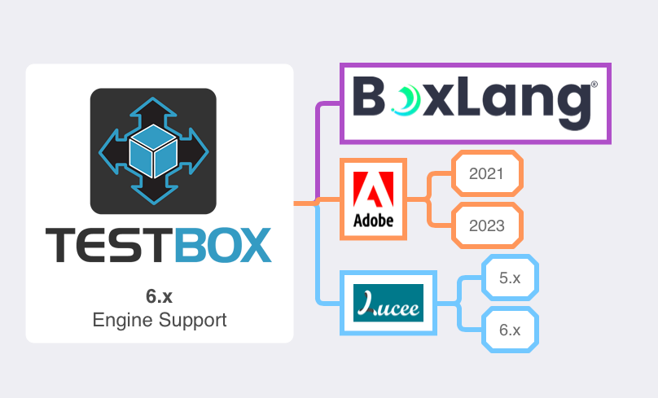

# Global Runner

TestBox ships with a global runner that can be used to run pretty much anything. You can customize it or place it wherever you need it.  You can find it in your distribution under:

* BoxLang: `/testbox/bx/test-browser`
* CFML: `/testbox/cfml/test-browser`

This is a mini web application to help you run bundles, directory, specs and more.

<figure><figcaption></figcaption></figure>
