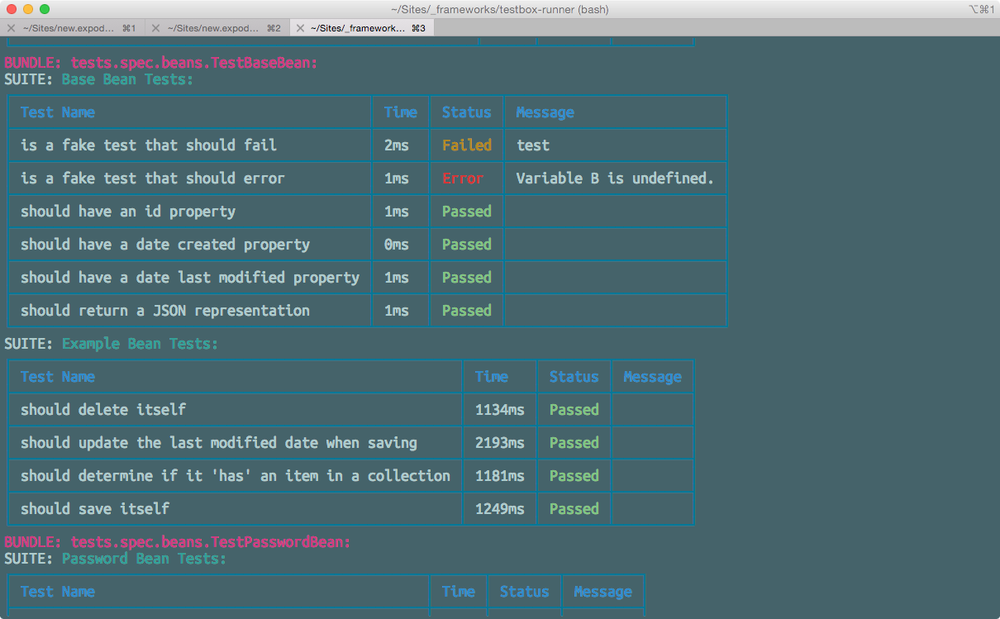

# NodeJS Runner

There is a user-contributed NodeJS Runner that looks fantastic and can be downloaded here: [https://www.npmjs.com/package/testbox-runner](https://www.npmjs.com/package/testbox-runner)



You can use node to install as well into your projects.

```bash
npm install -g testbox-runner
```

### Configuration

Create a config file called `.testbox-runnerrc` in the root of your web project.

```json
{
	"runner": "http://localhost/testbox/system/runners/HTMLRunner.cfm",
	"directory": "/tests/specs",
	"recurse": true
}
```

Then use the CLI command to run whatever you configured.

`testbox-runner`

You can also specify a specific configuration file:

`testbox-runner --config /path/to/config/file.json`

#### Command Line Arguments

Simply run the utility and pass the above configuration options prefixed with `--`.

**Example**

```bash
testbox-runner 
    --runner http://localhost/testbox/system/runners/HTMLRunner.cfm 
    --directory /tests 
    --recurse true
```
