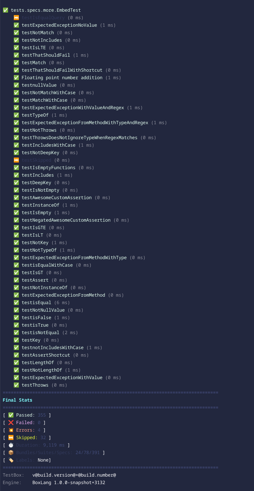

# What's New With 6.3.0

We are excited to announce the release of TestBox 6.3.0. This version emphasizes the all-new **BoxLang Reporter**, now with vibrant color outputs and seamless execution through BoxLang, improving the testing experience. To benefit from these improvements, update now and ensure your testing remains reliable and efficient.

You can find the new BoxLang runners in the root of the TestBox package:

* `/testbox/run` - Unix/Mac runner
* `/testbox/run.bat` - Windows runner

These runners will allow you to run any of your specs and bundles right from the CLI using BoxLang.  Please read more in the [BoxLang Runner section.](../../getting-started/running-tests/boxlang-cli-runner.md)

<figure><figcaption>
BoxLang Console Reporter
</figcaption></figure>

## Improvements

* [TESTBOX-417](https://ortussolutions.atlassian.net/browse/TESTBOX-417) BoxLang only usage improvements
* [TESTBOX-419](https://ortussolutions.atlassian.net/browse/TESTBOX-419) Console reporter now includes colors and the ability to execute via boxlang

## Bugs

* [TESTBOX-418](https://ortussolutions.atlassian.net/browse/TESTBOX-418) `initArgs.bundles` can be an array or simple value, consolidate it in boxlang runner
* [TESTBOX-420](https://ortussolutions.atlassian.net/browse/TESTBOX-420) Reporter options not being passed correctly
